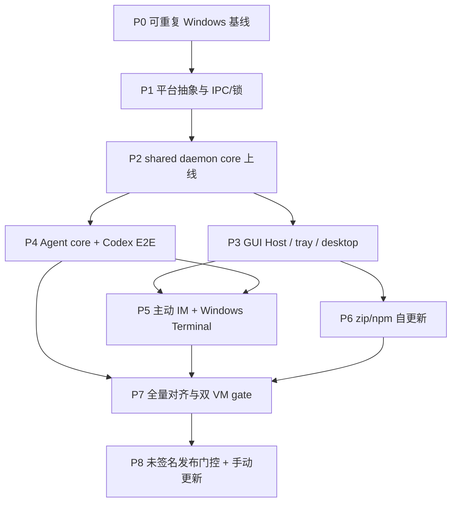

# Windows 平台功能与架构对齐实施计划

对应规格：[`../specs/windows-platform-parity.md`](../specs/windows-platform-parity.md)

状态：**P0–P7 代码级完成；未签名更新门控已实施，生产签名后置**

策略：长期开发分支，小提交、阶段 gate，完整验收后一次合并主线

## 1. 实施原则

1. 先修可重复基线，再抽平台边界；不在红色 Windows 测试集上直接大改 daemon。
2. 抽取一个 shared core，不复制 `windows_impl` 业务实现。
3. 每阶段同时完成代码、自动测试、Windows VM smoke 和文档记录；阶段完成不代表可提前发布。
4. 安全边界（pipe ACL、peer/session、permission identity、update rollback）与功能同时实现。
5. Win11 VM 持续验证；Win10 22H2 VM 在发布候选阶段加入正式 gate。
6. 生产 Authenticode、原生安装器、ARM64 与多会话均留到后续独立项目。

## 2. 阶段依赖

P3、P4、P6 在 P2 完成后可以由不同开发者并行，但共享文件变更必须先约定 adapter 接口；本计划不要求
为了并行创建第二份业务状态机。

## 3. P0：建立可信 Windows 基线

目标：让 Windows 安装、测试和 CI 先能稳定暴露真实问题。

### 工作项

- 修复 `scripts/build-frontend-if-needed.mjs` 在 Node 24/Windows 对 `pnpm.cmd` 的调用：
  - 优先解析/执行实际 JS entry 或显式调用 `cmd.exe /d /s /c` 与固定参数；
  - 不把 workspace path 或用户输入插进未转义 shell string；
  - 为 `.cmd` resolver 增加 Windows unit test。
- 审计 `scripts/install-windows.ps1`：
  - 同时兼容 Windows PowerShell 5.1 与 PowerShell 7；
  - 处理 UTF-8/BOM、路径含空格/中文、错误码传播、重复安装；
  - 安装失败不得留下半写入 binary 或 PATH 配置。
- 把当前 27 个 Windows Rust test failures 分类并逐项修成：
  - 跨平台有效的测试改用 `tempdir`/native paths 与平台中立 fixture；
  - 真正 Unix-only 的行为明确放入 Unix adapter tests；
  - Windows 必须支持的 permission/process/path 行为新增 Windows expectation，不能简单 `cfg` 掉。
- 清理当前 12 个 Windows 编译 warning；新增 warning budget（新 warning 阻断）。
- 扩充 `.github/workflows/build.yml` 的 Windows job：
  - 前端 Vitest 与 build；
  - Rust tests；
  - release build；
  - Windows 可用的 fmt/lint/clippy；
  - 保留 artifact 供后续 smoke。
- 新增 Windows baseline 脚本/记录模板，输出 OS build、PowerShell、Node、pnpm、Rust、WebView2、commit、
  测试摘要，不记录 secret。

### Gate P0

- Win11 VM 上 `install-windows.ps1` 通过，安装出的 `AskHuman.exe version` 可运行。
- Windows CI 全绿；已知功能不支持可以有明确测试，但不能靠 no-op/skip 隐藏。
- 现有 Linux/macOS CI 无回归。

## 4. P1：收敛平台抽象，落地 Windows IPC 与锁

目标：先建立 shared core 可以依赖的稳定 OS seam。

### 4.1 IPC transport

- 将 `ipc/transport.rs` 拆为 platform-neutral facade 与 Unix/Windows backend。
- 定义统一的 connect/listen/accept/split/shutdown/peer API；reader/writer 可用 trait object、enum wrapper
  或 generic，但不得让业务模块继续引用 `OwnedReadHalf`/`OwnedWriteHalf`。
- Windows daemon 与 GUI Host 分别使用 Tokio named pipe：
  - byte mode承载现有 NDJSON；
  - server 预建下一 instance；
  - client 对 busy/not-found 做有界重试并触发 daemon spawn；
  - endpoint 由当前 user/logon identity + normalized `config_dir()` hash 组成；
  - 禁止 remote client，设置当前用户 ACL，并记录可测试的 security descriptor。
- 把 version handshake、oversized/malformed frame、half-close、timeout、concurrent clients 做成跨平台
  contract tests。

### 4.2 单例与数据锁

- 建立 `platform::lock`：
  - Unix 保持现有 flock 语义；
  - Windows 用 named mutex/`LockFileEx` 实现 owner、try-lock、abandoned recovery、RAII release；
  - key 包含 AskHuman 实例分区，Dev Instance 不相互阻塞。
- 盘点并迁移所有 Windows no-op lock：daemon/GUI Host singleton、todo、history、update、integration 与
  其他 read-modify-write 路径。
- 明确 lock ordering，增加并发/崩溃恢复 tests，避免 daemon 与 updater 死锁。

### 4.3 进程启动基础

- 建立 Windows spawn helper，集中处理 `DETACHED_PROCESS`、`CREATE_NEW_PROCESS_GROUP`、
  `CREATE_NO_WINDOW`、stdio inheritance 与 argv quoting。
- CLI 本身保留 console I/O；daemon/helper/GUI Host 不弹额外 console。
- 增加后台 child readiness、早退、exit-code 与日志重定向测试。

### Gate P1

- Windows 原生 integration test 可并发连接 daemon-test server 与 GUI-test server。
- 非当前用户/错误实例 endpoint 无法访问；同一实例只能有一个 owner。
- 强杀 test owner 后，新进程可恢复 pipe 和 locks。
- Unix IPC/lock/spawn tests 继续通过。

## 5. P2：抽取 shared daemon core，接通 Windows 数据面

目标：消除 `daemon/unix_impl` 作为业务实现边界，让 Windows 首次运行完整 daemon。

### 5.1 先固化行为

- 为当前 Unix daemon 建 characterization tests，至少覆盖：
  - hello/version/restart；
  - ask/cancel/timeout/coalescing/dedupe；
  - pending ownership 与 agent registry；
  - channel connect/reconnect/config watch；
  - graceful drain 与 update state；
  - malformed client 与 backpressure。
- 把平台差异替换为注入的 transport、lock、process、spawn、clock/filewatch adapter。

### 5.2 机械抽取与接线

- 把请求路由、state、IM routers、Agent registry、config watcher、drain/update coordination 从
  `daemon/unix_impl` 移到 `daemon/server`/`daemon/runtime`。
- Unix adapter 先切到 shared core 并保持行为不变，再接 Windows adapter；避免同时重写两端。
- 将 `client/mod.rs`、`main.rs` 和 ask path 改为 cross-platform；移除不合理的 `cfg(unix)` compile gate。
- Windows daemon 实现懒启动、readiness/version handshake、日志、crash recovery 与 binary-change restart。
- 登录启动使用 per-user、non-elevated Windows mechanism；install/enable/disable/uninstall 幂等。具体选
  HKCU Run、Startup shortcut 或 Task Scheduler 前，做一个最小 spike，按无 UAC、可清理、GUI session
  归属和签名后的稳定性选型，并把决定补进 spec。
- 让四个 IM channel router 在 Windows daemon 中按相同单连接规则运行；通过 deterministic mock IM
  测试，不要求此阶段使用真实外部消息服务。

### 5.3 暂时切换策略

- 开发分支可用内部 env/diagnostic flag 对照旧 fallback；默认开发构建逐步切到 daemon。
- 不允许新旧路径同时写 history/todos/integration state。
- 在 P7 前保留一键诊断回退；P7 删除产品级 fallback。

### Gate P2

- Win11 上 `daemon start/status/stop/restart`、自动拉起和 login restart 通过。
- CLI ask 走 named pipe daemon，mock channel 完成请求/回答/取消/超时/去重。
- 两个并发 CLI 不会创建两个 router 或损坏共享状态。
- `doctor --json` 对 daemon/channel 使用运行时状态，不再报告 `windows_daemon_unsupported`。

## 6. P3：GUI Host、托盘与桌面体验

目标：把已有桌面功能接入 Windows GUI Host。

### 工作项

- 把 GUI Host server/client 抽到 shared core + IPC adapter，Windows 使用独立 secure named pipe。
- 移除 tray 模块的整体 `cfg(unix)`；保留真正 macOS/Linux-specific 的菜单或 API 分支。
- 接通窗口单例和路由：question popup、history、settings、todos、Agents console、new task、fork、
  interject。
- 验证并适配 popup prewarm、focus arbitration、窗口置前、pin、find、composer、快捷键和多窗口行为。
- 建立 Windows login GUI Host 启动/退出语义；daemon 与 GUI Host 分离，后台 IM 不依赖窗口常驻。
- 实现 Windows system sound；用户 hook 支持 `.exe`/PowerShell/批处理的安全 argv 形式，保留超时、
  stdout/stderr 限制与失败隔离。
- 明确 WebView2 bootstrap：正式支持系统应能自动满足或给出可执行的安装提示，不把空白窗口当作成功。
- 为 Windows 的 DPI、多显示器、深浅主题、输入法、剪贴板、文件附件路径建立人工矩阵。

### Gate P3

- Win11 本地交互矩阵中的所有窗口可打开、复用、聚焦、关闭和从 tray 恢复。
- daemon 单独运行时不弹 console，退出 tray 后按产品定义保留或停止 daemon。
- popup 全流程在 WebView2 下完成，截图/日志记录无 layout blocker。
- 登录/注销、睡眠/恢复、GUI Host 强杀均可自动恢复且不丢 pending request。

## 7. P4：Windows 进程识别与 Codex 真机集成

目标：恢复 Agent lifecycle/permission/stop/interject 的安全证据链，并完成 Codex E2E。

### 7.1 Process inspector

- 定义统一接口：liveness、parent chain、exe、command line、session、creation identity、workspace hints。
- Windows backend 使用 Windows API/Rust crate；评估 Toolhelp snapshot + query process information，必要时
  限定权限和缓存。高频 hook 不启动 PowerShell/WMI 子进程。
- 实现 Windows path identity：drive/UNC、case-insensitive component、separator、long path、symlink/junction、
  不存在 path 和拒绝访问；不确定时 fail closed。
- 修复当前 context binding、workspace recovery、permission rules/memory 测试，用 platform-neutral fixture
  加 Windows-specific cases。

### 7.2 Hooks 与 Agent 状态机

- 移除 capability 的 `cfg!(unix)` 判定，改为 adapter capability + 版本/schema 检测。
- Codex：
  - 以当前安装版官方 schema 为准，生成 Windows hook command（如 `commandWindows`）；
  - 重新对拍 user/project/managed 层叠与 trust；
  - identity hash/verification 纳入 Windows command fields；
  - 覆盖路径空格、中文、PowerShell 5/7、直接 exe 调用与 stderr。
- Claude/Cursor：用可执行 `.exe`/直接 argv 或 Windows PowerShell 脚本替代 `.sh` 假设，配置写入必须
  format-preserving、可回滚。
- Grok：为 Windows process/project partition 与 context claim 增加模拟进程树测试。
- 所有 Agent 共用 lifecycle/registry/pending/watchdog core，不为 Codex 新建特例状态机。

### 7.3 Codex 真实 E2E 矩阵

在 Win11 VM 安装受支持 Codex 版本后验证：

1. 首次安装/更新 hooks 与用户确认；
2. SessionStart/SessionEnd 和异常终止；
3. AskHuman 自由文本/选项/附件/取消/超时；
4. compaction 后 `show_last` 恢复；
5. permission remember 的 session/project/user 层级与危险命令 fail closed；
6. stop confirmation 与 interject；
7. 两个 workspace、同名 task、并发 session 的归属隔离；
8. daemon/GUI Host/Codex 分别重启后的恢复。

### Gate P4

- Windows Agent 相关 test 全绿，非 Windows Agent tests 无回归。
- `doctor --json` 显示 Codex 的 installed/configured/live/verified 等分层事实。
- Codex Win11 E2E 全部通过并有版本、commit 和日志摘要；Claude/Cursor/Grok 明确标记为 simulated，
  不宣称真实 E2E。

## 8. P5：主动 IM 命令与 Windows Terminal

目标：补全由 daemon/GUI Host/Agent registry 支撑的主动控制面。

### 工作项

- 建立 `platform::terminal::windows`：
  - 首选 `wt.exe`，明确 PowerShell profile/shell 选择；
  - 精确 argv quoting，cwd/path 含空格与中文；
  - 无 Windows Terminal 时给出支持的 fallback 或清晰安装提示；
  - 启动后等待 Agent lifecycle ready，超时可诊断并清理 pending launch。
- 接通 GUI new task/fork 与 IM `/new`、`/fork`。
- 逐个验证 `/status`、`/watch`、`/msg`、`/yolo`、`/diff`、`/stage`、`/transcript`、`/todo`，
  对 git、shell 和路径的 Windows 差异建立 tests。
- 验证四渠道只保留一个 router、active command permissions、request origin、always-respond 和断线恢复。
- 外部 IM 不适合 CI 的部分用 deterministic mock；至少选一个已配置测试渠道做 Win11 真实 smoke，渠道
  凭据不写入日志/fixture。

### Gate P5

- Win11 上从 tray/GUI/IM 启动与分叉 Codex task，registry 能正确追踪且可交互。
- 全部主动命令在 Windows 返回与 Unix 相同的结构和错误类别。
- 并发启动、超时、终端缺失、workspace 不存在、路径含特殊字符均有确定性结果。

## 9. P6：zip/npm 安装、升级与回滚

目标：让当前两种分发方式在 daemon/GUI Host 常驻条件下可靠维护。

### 9.1 Windows updater worker

- 设计单二进制的 updater role：先把当前/新 binary 的受信任 worker 放入实例专用临时目录，再从目标
  路径之外运行。
- 更新事务：验证 artifact → 请求 daemon/GUI Host/helpers drain → 等待 handles 释放 → 创建备份 →
  原子/可恢复替换 → 验证新版本 → 恢复原运行状态 → 清理。
- 失败时恢复 `.bak` 并保留诊断；重启中断时下次启动能判断并完成或回滚，不循环更新。
- 校验下载内容、版本/通道与签名接口；即使 P8 才注入真实证书，P6 就必须保留 sign/verify stage。

### 9.2 npm 与脚本

- npm updater 不在被覆盖的 package `.exe` 内直接执行：交给临时 worker/外部 launcher，待所有相关
  进程释放 package 后调用安全的 Windows npm command。
- 统一 `.cmd`/`.bat` process helper，覆盖 Node 24 和路径/参数 escaping；禁止复用 shell string 拼接。
- 验证 zip 解压运行、npm global install/update/uninstall、PATH 更新、两个 PowerShell 版本、非管理员用户。
- 提供显式 cleanup/uninstall 命令或脚本，移除 login entry、stale pipe/mutex state、托管 hooks 与临时
  updater；用户数据是否保留按现有产品语义并清楚提示。

### Gate P6

- Win11 完成 zip→新版 zip、npm→新版 npm、失败回滚、进程占用、网络中断、重复执行矩阵。
- 更新期间新 ask 请求得到 drain/retry 语义，不静默丢失。
- 卸载/清理后没有自启动孤儿进程或指向不存在 binary 的 Agent hooks。

## 10. P7：全量 cutover、回归与双 VM 发布 gate

目标：证明“功能与架构对齐”，并移除临时兼容路径。

### 10.1 Cutover

- Windows 所有公开入口默认且只走 shared daemon/GUI Host path。
- 删除产品级 single-process fallback、Unix-only capability matrix 和已失效的 unsupported 文案。
- 保留只用于排障的显式内部 opt-out 时，文档标明不保证功能且不能出现在常规 UI。
- 对 `cfg(unix)`/`cfg(not(unix))` 做一次全仓审计；每个残留必须属于真实 OS adapter 或平台专属功能。

### 10.2 Windows 10 VM

- 准备 Windows 10 22H2 x64、普通本地用户、最新可用 WebView2 的干净 VM。
- 记录可复建配置和快照边界，不复制 Win11 VM 的已安装状态。
- 执行与 Win11 相同的核心矩阵；旧 Win10 版本只做机会性 smoke，不纳入 blocker。

### 10.3 全量矩阵

- 自动：三平台 full suite、Windows adapter stress、协议兼容、update fixture、release artifact smoke。
- 桌面：tray/窗口/WebView2/DPI/多屏/输入法/文件选择/通知/系统声音/login。
- daemon：并发、崩溃、睡眠、注销、binary replace、配置热更新、channel reconnect、graceful drain。
- Agent：Win11 + Win10 Codex E2E，版本升级/降级与 hooks repair。
- 分发：两种渠道 clean install/update/rollback/cleanup。
- 性能：hook 热路径、daemon idle、popup warm/cold、pipe connect 不出现明显平台级回退。
- 安全：pipe ACL/remote denial、cross-instance/cross-user、hook identity、path forgery、update verification、
  secret/log redaction。

### 10.4 文档与审查

- 更新 `docs/overview.md` 中平台支持、daemon/GUI Host 和安装/更新入口；只改已经因实现而不准确的段落。
- 更新相关 daemon、Agent、self-update、tray specs，不复制相互冲突的规则。
- 在本计划附实施记录：commit、CI run、两台 VM 日期/版本、矩阵结果、已知限制。
- 审查长期分支相对主线的完整 diff；分阶段处理 review 意见后再一次合并。

### Gate P7

- 规格 WP-01～WP-11 除“签名”子项外均有可追踪证据。
- Win11 与 Win10 22H2 矩阵无 blocker；所有非 blocker 有 owner、解释与后续项。
- macOS/Linux 无功能或性能回归。
- 产品中没有错误展示为 unsupported 的 Windows 对齐功能。

## 11. P8：未签名发布门控与手动更新

2026-08-18 产品决定暂缓 Authenticode。当前阶段继续发布原名 Windows zip/npm，但所有应用内自动
apply 在源码策略、Tauri command、托盘 handler 和 Direct/npm updater 多层 fail closed；检查、日志和
忽略版本保留。`AskHuman update prepare` 等待在途请求完成后关闭 daemon/GUI Host，供用户手动安装。
完整设计与验收见 `docs/plans/windows-unsigned-update-policy.md`。

生产签名改为独立后置项目。恢复自动更新前必须重新完成 provider/密钥托管、publisher identity
pinning、可信 timestamp、证书轮换、zip/npm 产物等价性、SmartScreen 与 signed update/rollback，不能
只把源码 capability 改为 true。

### Gate P8 / 当前完成口径

- Windows 自动 apply 不执行网络、下载、临时目录、pending 或 drain 副作用；
- Direct/npm 手动路径和 `update prepare` 在真实 Windows 进程锁下可执行；
- release workflow 在没有 Azure 配置时继续产出同名 Windows zip/npm；
- macOS/Linux 自动更新无回归，Windows updater/WinVerifyTrust/rollback 代码继续保留。

## 12. 测试矩阵最低集合

| 层级 | 自动化 | Win11 VM | Win10 22H2 VM |
|---|---|---|---|
| install/build | PS5/PS7、Node 24、CI release | zip + npm | zip + npm |
| IPC/lock | native integration + stress | crash/sleep/concurrency | smoke + concurrency |
| daemon/channels | shared contracts + mock IM | full lifecycle + one real channel smoke | full lifecycle smoke |
| GUI/WebView2 | frontend tests | full UI/DPI/multi-monitor | core UI/WebView2 |
| Codex | config/process fixtures | full real E2E | full release E2E |
| 其他 Agent | schema + simulated process tree | install/config smoke if available | 非 blocker |
| active commands | mock channel integration | full command matrix | core command matrix |
| update | fixture/failure injection | full zip/npm/rollback | release upgrade/rollback |
| security | ACL/path/identity/update tests | cross-instance/non-admin | non-admin/signature |
| signing | artifact verify | installed artifact verify | installed artifact verify |

每次 VM 记录必须包含：OS build、AskHuman commit/version、Agent version、安装来源、测试日期、执行者、结果、
日志位置和偏差。敏感凭据只记录“已配置”，不得进入仓库。

## 13. 建议提交序列

长期分支内建议按以下 Conventional Commit 粒度推进，实际 scope 可随模块调整：

1. `fix(build): support node 24 command shims on windows`
2. `test(windows): establish native ci baseline`
3. `refactor(ipc): separate transport from daemon protocol`
4. `feat(daemon): add secure windows named-pipe transport`
5. `feat(daemon): add windows lifecycle and cross-process locks`
6. `refactor(daemon): move server logic into shared core`
7. `feat(popup): add windows gui host and tray support`
8. `feat(agents): add windows process inspection and codex hooks`
9. `feat(channels): enable active windows task control`
10. `feat(update): add transactional windows self-update`
11. `test(windows): add win10 and win11 release gates`
12. `build(release): sign windows artifacts`

提交主题进入 release notes 的类型应与真实用户影响一致；纯机械移动用 `refactor`，不要把重构噪声变成
用户 changelog。

## 14. 第一批可执行任务

P0 启动时按以下顺序工作：

1. 从主线建立 `codex/windows-platform-parity` 长期分支，并确认 Win11 VM 使用同一分支/commit。
2. 为 Node 24 `.cmd` 问题添加最小失败测试，修复前端构建 helper。
3. 在 PS5 与 PS7 各跑一次 installer，修复编码/错误传播并记录 baseline。
4. 给 27 个 Windows Rust failures 建 issue/checklist 映射，先修 path/temp fixture，再处理 Agent/permission
   语义；每一类都必须说明是跨平台 bug、adapter 缺失还是错误测试假设。
5. 让 Windows CI 运行完整 tests，再把它设为分支保护 gate。
6. P0 通过后，先提交 IPC facade 的只重构版本，再加入 named pipe；不要把 core 抽取与 transport 新实现
   混在同一 commit。

## 15. 回滚与范围控制

- P0～P6 只在开发分支内推进，不把半成品 Windows capability 发布到主线。
- 每个阶段保留前一阶段可运行 commit/tag；数据 schema 变更必须向后兼容或提供 migration/rollback。
- 若 shared core 抽取导致 Unix characterization tests 变化，先停止并定位，不用 Windows 分支逻辑修补
  Unix 语义。
- 新事实若要求改变已确认的 OS、Agent、分发、签名或会话范围，先更新规格并取得确认，再改计划。
- Authenticode 之后只接受签名/打包修复；任何功能性代码变化都返回 P7 重跑双 VM gate。

## 16. 实施记录（2026-08-15）

### 16.1 已完成范围

- 分支：`codex/windows-platform-parity`；实现基线 `b216b333`，本记录对应 `0f76bf7`。
- P0：修复 Node 24 在 Windows 直接 spawn `.cmd` 的 `EINVAL`，Windows CI 现运行 pnpm/Vitest、
  Node tests、Rust tests、Clippy 与 release build；安装脚本兼容 Windows PowerShell 5.1 和 PowerShell 7。
- P1–P2：CLI、hooks、GUI 与 IM 全部切到 shared daemon core；Unix socket / Windows byte-mode named
  pipe 位于同一 transport 抽象。named pipe 名称按当前 SID、Windows session 与规范化配置目录隔离，
  使用受保护 DACL（当前用户 + LocalSystem）并拒绝远程客户端。跨进程锁、后台启动、HKCU Run 与
  native process identity 均有 Windows adapter，不保留产品级 single-process fallback。
- P3：Windows GUI Host、托盘、设置/历史/待办/Agent/Interject/新建任务/Fork 单窗路由与 daemon 状态
  订阅已启用；system sound 使用 `MessageBeep`；用户 hooks 支持 `.exe/.ps1/.cmd/.bat`、10 秒边界和
  stdout/stderr 隔离。
- P4：四家 Agent lifecycle/context/stop/subagent/permission 集成在 Windows 可安装和修复。Codex 生成
  `commandWindows` 并按 Windows 实际命令写 trusted hash；进程发现用 Toolhelp、
  QueryFullProcessImageName、NtQueryInformationProcess、ProcessIdToSessionId 与 GetProcessTimes，hook
  热路径不启动 PowerShell/WMI。Claude/Cursor timeout hook 生成 PowerShell 5 兼容脚本。Codex shell
  permission memory 使用保守 PowerShell literal parser；变量、替换、重定向、分组、调用运算符和歧义
  形式全部 fail-closed 回基础审批。
- P5：主动 IM command 与 Agent 控制台能力复用 shared daemon；新建/Fork 使用 `wt.exe` direct argv
  打开 Windows Terminal tab，task/cwd/flags 不拼入 shell 字符串，缺少 Terminal 时返回可恢复错误。
- P6：direct 与 npm 更新均使用安装目录外事务 worker，排空 daemon/GUI Host 后备份、替换、校验、
  回滚并恢复原运行角色。Direct asset 先校验 `SHA256SUMS`、版本与 WinVerifyTrust Authenticode；npm
  安全解析并调用 `npm.cmd`。worker 日志轮换，过期临时目录自动清理。
- P7 维护面：增加幂等 `agents cleanup`、`scripts/uninstall-windows.ps1`（默认保留用户数据，
  `-PurgeData` 显式清除）与 `scripts/verify-windows-signature.ps1`；installer 使用 staging + hash +
  `Move-Item` 事务复制，幂等维护当前用户 `PATH` 和带所有权标记的 `WindowsApps\AskHuman.cmd`；uninstaller
  只移除对应安装目录和自身 launcher。`.cmd` 安装入口在默认 Execution Policy 下调用 PS5 脚本。
- P8 决策更新（2026-08-18）：生产 Authenticode/SmartScreen 暂缓为独立项目；release workflow 移除
  当前不可满足的 Azure gate，继续产出原名 Windows zip/npm。源码 capability 固定关闭 Windows 自动
  apply，保留 updater/transaction/rollback/WinVerifyTrust 代码；手动闭环见
  `docs/plans/windows-unsigned-update-policy.md`。

### 16.2 Win11 VM 证据

环境：Windows 11 Home 24H2 x64、普通用户、Node 24.19、pnpm 10.34.5、Rust 1.97、Windows
PowerShell 5.1、PowerShell 7.6.5。SSH 仅用于构建与自动测试，符合本规格会话边界。

| Gate | 结果 |
|---|---|
| PS5 / PS7 脚本解析 | installer、uninstaller、signature verifier 通过 |
| install | PS5 与 PS7 安装均通过；最终二进制安装到 `%LOCALAPPDATA%\Programs\AskHuman\AskHuman.exe` |
| user PATH | PS5 真实安装自动加入目录；重复添加保持 1 条；临时目录 add/remove 往返不影响其他条目；新进程 `Get-Command AskHuman` 与 `AskHuman --version` 通过 |
| daemon | `daemon start --force` 成功；protocol 2；named pipe endpoint；`agents monitor --json` 返回快照 |
| Rust tests | 1090 tests：1088 passed、0 failed、2 ignored |
| Clippy | `--all-targets -- -D warnings` 通过 |
| frontend / Node | Vitest 160 passed；Node command-shim tests 3 passed；production build 通过 |
| Codex E2E | `codex-cli 0.147.0`、ChatGPT 登录；CLI mode + lifecycle + permission + stop 安装成功；生成 `commandWindows`/trusted hashes；真实 authenticated `codex exec` 返回 `WINDOWS_CODEX_E2E_OK` |
| maintenance | 临时安装目录完整执行 cleanup/daemon stop/remove；目录删除、用户数据保留，随后成功恢复 daemon 与 Codex integration |
| signing negative | 未签名开发 binary 被 verifier 以 `NotSigned` 拒绝，证明 release gate fail-closed |

### 16.3 尚需外部状态的发布 Gate

这些项目不需要继续修改 shared architecture，但在对外宣称“Windows release certified”前必须完成：

1. 新建干净 Windows 10 22H2 x64 VM，复跑 §12 核心矩阵；当前只有 Win11 VM。
2. 生产 Authenticode、publisher identity pinning、timestamp 与 SmartScreen 已决定暂缓；恢复时另立
   签名项目，验证 zip/npm 同一签名 binary 和 signed update/rollback 后才能打开自动 apply capability。
3. 在交互式 Windows 桌面手工验收 tray、WebView2、DPI/多屏/输入法、文件选择、声音、登录/注销；
   SSH 会话不能替代视觉/焦点验收。
4. 用至少一个真实 IM 凭据跑主动命令和重连 smoke；自动化已覆盖 mock Router/协议，但测试 VM 未配置
   生产凭据。
5. 当前未签名 release 复跑 direct/npm clean install 与手动更新准备；自动 apply 必须稳定拒绝。未来签名
   release candidate 再复跑 automatic upgrade/rollback。

ARM64、原生 installer 与 Windows Server/RDS 多会话仍按已确认范围另立项目，不属于上述 release
blocking gate。

## 17. P7 对齐复审与缺口收口计划（2026-08-15）

### 17.1 背景与完成口径

首轮实现已经打通 Windows daemon、GUI Host、Agent、主动命令、更新和安装主链路，但二次全仓审计与
Win11 桌面试用证明，仍有一些功能被旧的 `cfg(unix)`、macOS 展示假设或历史目录命名遗漏。因此 §16
不能解释为“Windows 已完全对齐”，本节是进入发布 Gate 前必须执行的收口批次。

本批次完成口径不是“Windows 能编译”，而是：

1. 除明确列入“有意的平台差异”外，Windows 上的入口、行为、展示、错误类别与 macOS/Linux 对齐；
2. shared daemon 代码在目录和模块边界上也不再伪装成 Unix 实现；
3. 三项 Win11 实机反馈（应用图标、飞书自动识别关窗、macOS 快捷键文案）均有回归测试与桌面证据；
4. Windows 全量自动测试、Codex E2E 和桌面矩阵重跑，无新增 macOS/Linux 回归；
5. 未完成的 Win10、生产签名、SmartScreen 与真实渠道发布 Gate 仍明确保留，不以 mock 结果冒充。

### 17.2 已确认缺口清单

| 编号 | 范围 | 已确认事实 | 目标 |
|---|---|---|---|
| C1 | 设置页能力 | Advanced、实验项、tray、预热、Agent task、Windows Terminal 等仍有旧平台门禁；当前工作区已有第一轮修复但未完整验收 | Windows 显示并执行所有已支持能力，搜索索引和说明同步 |
| C2 | 应用图标 | macOS 运行时内嵌 `icons/icon.png`（机器人问号）；Windows bundle 的 `icon.ico`/多尺寸 PNG 是另一套青黄图标 | 以 `icon.png` 为唯一源重新生成全套 bundle 资源；Windows EXE、任务栏、窗口与文件属性一致 |
| C3 | 快捷键 | 业务事件多数已接受 Meta/Ctrl，但提交、取消、选项、导航、插话、任务、待办、Console、冲突提示与录制预览多处写死 `⌘`；默认 `cmd+d` 在 Windows 还存在匹配语义歧义 | 建立“主修饰键”抽象：macOS=`⌘`，Windows/Linux=`Ctrl`；展示与实际触发一致，旧配置兼容 |
| C4 | 飞书自动识别 | 前端流程只有 prepare → 最长 120 秒 wait → 成功/错误/取消，不包含关窗操作；因此 Win11 上窗口消失需从 GUI Host 生命周期、进程异常和长连接路径定位 | 自动识别成功、超时、取消、daemon 断连时设置窗口都保持打开；异常有无敏感信息的诊断记录 |
| C5 | 本地时间 | `show_last` 绝对时间和 `watch` 时间在 Windows 仍走 UTC fallback | Windows 使用系统本地时区，与 macOS/Linux 输出一致 |
| C6 | Secret 输入 | CLI secret prompt 在 Windows 使用可见 `read_line` | 使用 Windows console API 隐藏输入并可靠恢复 echo；重定向 stdin 时 fail closed |
| C7 | Cursor | `state.vscdb` 只搜 macOS/Linux HOME 路径；最近 workspace 恢复以 `/` 为根 | 支持 `%APPDATA%\\Cursor\\User\\globalStorage\\state.vscdb`、盘符/UNC/case 语义及路径含空格中文 |
| C8 | Agent 定位 | terminal focus backend 只实现 macOS；Windows 虽可用 `wt.exe` 启动任务，却不能把已有任务对应 tab/window 精确前置 | 为 Windows Terminal 建立可验证的稳定任务—window/tab 关联；找不到时返回明确错误，不猜 PID |
| C9 | Dev Instance | Windows `AskHuman dev` 将 daemon 报为 n/a，installer 不识别 `.askhuman-dev/bin`，相关说明偏 Unix | Windows worktree/Dev Instance 可启停、隔离 daemon/GUI Host/channel preset，并可安装卸载 |
| C10 | shared 架构 | shared daemon 仍由 `#[path="unix_impl/mod.rs"]` 和 `daemon/unix_impl` 承载 | 机械迁到 `daemon/runtime`/`daemon/server`，平台 adapter 单独命名；行为与协议零变化 |
| C11 | GUI Host 登录 | CLI 拉起已隐藏 console；HKCU Run 直接启动 console-subsystem EXE 是否闪窗尚未经过真实注销/登录验证 | 实机验证；如闪窗，改用受管无控制台 launcher/等价启动方式，并保证卸载可清理 |
| C12 | 文档与旧文案 | README、overview、IM command、配置说明、TS 注释和 Windows unsupported 文案仍与实现冲突 | 以最终行为统一更新，移除错误的 macOS/Linux-only 声明 |

有意保留的平台差异：macOS 的材质/动画、Quick Look、SpeechAnalyzer；Windows 的 Credential Manager、
NTFS profile ACL 继承、`MessageBeep`、named pipe、HKCU Run；未安装 Windows Terminal 时返回清晰的可恢复
错误。系统托盘的多状态单色图标是状态语义资源，不随 C2 替换为应用图标。

### 17.3 工作流 A：设置页、图标与快捷键展示

#### A1. 设置页能力收口

- 复核并完成当前工作区中的 Advanced tab、生命周期、Agent task、tray、实验项与 Windows Terminal 变更；
- 设置搜索按“能力是否存在”建索引，Windows 已支持的系统声音不能再被 macOS 条件排除；
- 删除 `windowsUnsupported` 等失效分支，修正 `types.ts`/Rust command 中“仅 macOS/Linux”的旧注释；
- 增加 Windows platform mock 的 tab/search/component tests，并在 Win11 逐项点击验证。

#### A2. 单一应用图标源

- 将 `src-tauri/icons/icon.png` 定为 canonical source，使用可复现脚本/固定工具生成 32、128、256、ICNS、
  ICO 多分辨率资源，不手工维护彼此不同的位图；
- 添加资源校验：必需尺寸/alpha 存在，生成物清单固定，避免以后只换 macOS runtime PNG；
- 重新构建 Windows release binary 后验证资源管理器、EXE 属性、任务栏、窗口标题栏和 Alt+Tab；清理
  Windows icon cache 只作为验证手段，不写入安装逻辑；
- 保留 `icons/tray/*` 的 idle/active/stopped/attention 状态图标。

#### A3. 平台主修饰键

- 在前端 platform/shortcut 层提供唯一 API：主修饰键事件判定、短/长标签、组合键格式化、录制预览；
- 将配置中的历史 `cmd` token 解释为“主修饰键”以兼容默认 `cmd+d`：macOS 匹配 Meta，Windows/Linux
  匹配 Ctrl；显式 Ctrl/Alt/Shift 组合继续可解析，保存时输出稳定规范串；
- 替换 Popup、Confirm、Interject、Todos、New/Fork Task、Console 和 Settings 中所有用户可见的硬编码
  `⌘`，i18n 冲突文案改为参数化标签；
- 测试 macOS `⌘↵/⌘W/⌘1`、Windows/Linux `Ctrl+Enter/Ctrl+W/Ctrl+1` 的展示和触发严格一致，覆盖
  IME、裸 Enter 模式、可定制语音快捷键及旧配置载入。

### 17.4 工作流 B：飞书自动识别关窗专项

先复现和留证，再改生命周期；不把“延长超时”当作修复。

1. 在 GUI Host 增加最小诊断：进程启动/退出原因、窗口 create/destroy/recount、panic/abort 可定位信息、
   detect 阶段（prepare/wait/success/cancel/timeout/daemon disconnect）；日志不得包含 App Secret、token、
   open_id 或识别码。
2. 在同一 Win11 配置下分别从命令、tray 与设置入口打开 Channels，启动飞书自动识别，记录
   12 秒 host grace、15 秒 binary watch、120 秒 detect timeout 前后的进程、窗口和 daemon 状态；同时检查
   Windows Application Error/WER 事件，区分“窗口被销毁”“GUI Host 正常退出”“进程 crash”。
3. 根据证据修复对应层：
   - 若是窗口租约/计数错误，使 hosted window 在长 Tauri command 期间仍持有 host lease；
   - 若是 host 换新，binary refresh 只能在真实零窗口时发生；
   - 若是 WebSocket/FFI panic，消除 panic/abort 并把错误返回 UI；
   - 若是 daemon 断连，wait 返回可恢复错误且窗口继续存在；
   - 将全局单槽取消状态收敛为明确的 detect operation identity，避免旧请求误取消新请求。
4. 增加可控 mock 长连接集成测试，至少让窗口跨过 12 秒、15 秒和 120 秒边界，覆盖成功、取消、超时、
   daemon restart、重复点击与关闭窗口后的连接清理。
5. 使用真实飞书凭据做一次 Win11 成功识别和一次取消；只记录结果与时间，不保存凭据/识别值。

### 17.5 工作流 C：Windows 运行时与 Agent 细节

#### C1. 时间、secret 与用户路径

- 将本地时间转换抽为跨平台 helper，Windows 使用系统时区 API/受维护 crate；以固定时区 fixture 测
  DST、午夜与无效时间；
- Windows secret prompt 使用 console mode guard，成功、Ctrl+C、EOF 和错误路径均恢复输入模式；
- `~`/home 解析统一改用 `dirs::home_dir()`，Windows path 测试不再依赖 `HOME`。

#### C2. Cursor Windows 数据路径

- 从 Roaming AppData 寻找 Cursor global storage，并保留可注入候选路径供 unit test；
- workspace key 解析使用盘符/UNC-aware root，不构造 Unix `/`；对 `C:\\`、大小写、空格、中文、UNC、
  不存在/拒绝访问建 fixture；
- 在 VM 有 Cursor 时做 read-only smoke；未安装时只声称 simulated coverage。

#### C3. Windows Terminal focus

- VM 当前 Windows Terminal 1.18 支持命名 window、固定 tab title 与 `focus-tab`；每个 AskHuman task
  使用独占命名窗口与 `--suppressApplicationTitle` 固定 tab 0 标题，并把 launch UUID 持久化进
  AgentRegistry；
- launch helper 在 Agent 启动前按固定标题与 `WindowsTerminal.exe` owner 唯一匹配顶层窗口，持久化
  `{launch UUID, HWND, owner PID}`。focus 先验证 HWND 仍存在、PID 未变化且 owner 仍为 Windows Terminal，
  只有验证通过后才对该已知存活的命名窗口调用 `focus-tab -t 0`，从而既能从非活动 tab 切回，又不会因
  `wt -w <name>` 的隐式创建语义产生幽灵窗口；
- tab 0 激活后必须在有界时间内恢复固定标题，再 restore/foreground 同一 HWND；Windows 拒绝后台激活时，
  仅在真实点击调用中临时附加 foreground/target input queue 后重试，并保证 detach；
- 覆盖窗口被关、tab 被改名、Terminal 重启、多 task/多 workspace 与 Terminal 未安装；失败时 GUI/IM
  返回相同错误类别。

Win11 桌面证据（Windows Terminal 1.18.10301）：登记 HWND `1442890` 后先把同一命名窗口切到 tab 1，
活动标题为 `Windows PowerShell`；点击真实 AskHuman Popup 的 `Codex ↗` badge 后，同一 HWND 的活动标题
恢复为 `AskHuman Agent [afbc362b-e50f-4c3c-a23d-b3eea303f409]`，且 foreground HWND 精确等于登记 HWND。

#### C4. Ctrl+C 与多渠道终结

- Popup 窗口生命周期是本地取消的主信号：请求尚未 terminal 时窗口销毁必须向 daemon 发送 Cancel；
  已 terminal 后销毁只发送 dismissal，不重复改变结果；
- 标准 MCP `notifications/cancelled` 仍是协议主路径。Codex CLI 0.147 在 Ctrl+C 时可能只在精确 rollout
  turn 写入 `turn_aborted` 而不发 MCP cancellation，因此 AskHuman MCP 仅对带精确 Codex
  `{session_id, turn_id}` metadata 的调用，从调用开始时的 rollout EOF 位置监听匹配事件作为兼容保险；
  不匹配的 session/turn、普通文本与其他 Agent 均不得触发；
- caller disconnect 时 daemon 先从请求 registry 移除并关闭 Popup，再等待所有非 Popup 渠道的 terminal
  card finalizer（沿用 5 秒有界窗口）；飞书成功/失败只记录无敏感信息的固定 action；
- Win11 真实 Codex 0.147 + 飞书验证：Ctrl+C 后 rollout 命中，Popup 销毁，飞书卡片 PATCH 成功，daemon
  记录 `cancellation finalized`，未走 timeout。

### 17.6 工作流 D：Dev Instance、GUI Host 启动与 shared 架构

#### D1. Windows Dev Instance

- `cli/dev_cmd.rs` 的 status/stop 已接到跨平台 lifecycle；disable 同时关闭本实例 daemon 与 GUI Host，
  Windows 优雅退出超时后仅按规范化 Dev EXE 精确路径收口残留 helper，再等待锁释放后 purge；
- `install-windows.ps1/.cmd` 已识别 worktree Dev Instance，默认安装到隔离的
  `.askhuman-dev/bin/AskHuman.exe`，保持 named pipe、锁、配置、日志与正式实例隔离；显式 `-Global`
  是生产安装逃生口，显式 `INSTALL_DIR` 仍优先；
- Windows detached daemon 使用禁止 handle inheritance 的 `CreateProcessW` 路径，并由后台 role 自写日志，
  PowerShell/CI 捕获 `daemon start` 输出时可正常收到 EOF；installer 的多行 daemon status 使用显式 regex
  match，不依赖 PowerShell 集合匹配的全局 `$Matches`；
- Win11 PS5 真实全流程通过：Dev bin 安装、独立 pipe daemon start/status、生产逃生口事务安装、disable
  purge。断言 `devInstallPreservedProductionBinary`、`globalInstalledStateMatches`、生产 config、launcher、
  user PATH 不变、Dev 目录删除均为 `True`；channel preset 沿用既有跨平台实现与租约测试。

#### D2. 登录启动无闪窗

- HKCU Run 不再直接启动 console-subsystem EXE；GUI Host 与 keepalive daemon 共用配置目录内受管的
  UTF-16 `askhuman-login.vbs`，注册表以 `wscript.exe //B //NoLogo` 调用固定 `gui-host`/`daemon` 角色，
  VBScript 用 hidden window style 异步拉起 EXE；CLI 自身仍保留正常控制台输出；
- launcher 内容包含当前安装 EXE，升级/路径变化时随 login item 幂等刷新；两项 Run value 都移除后删除
  launcher，Windows uninstaller 也显式清理；Dev Instance 继续被全局登录项 guard 拒绝；
- Win11 真实注销后重启自动登录：Explorer 从 Session 2/PID 9032 变为 Session 1/PID 5588，GUI Host、
  daemon 与 warm popup 均在 Session 1 恢复。登录最初 6 秒采集 60 帧截图并逐帧枚举可见顶层窗口，未出现
  conhost/PowerShell/cmd/AskHuman 控制台；Run 项均为受管 wscript 命令，临时审计项完成后自删。

#### D3. shared daemon 目录归位

- shared server core 已从历史 `daemon/unix_impl` 机械迁移到平台中性的 `daemon/runtime`，`daemon/mod.rs`
  直接映射该模块；子模块 detect/fork/inbound/select/subs/todo/watch 同步迁移，无协议或状态机改动；
- socket/named-pipe、Unix session 与 Windows process/login 等真实差异仍位于 transport/lifecycle/spawn/
  integration adapter，不以目录名伪装 shared core；
- 迁移后 macOS 本机 `cargo fmt --check`、`cargo check` 与 Rust full suite 通过：1129 passed、0 failed、
  2 ignored；Windows 原生最终矩阵也已通过，证据见 §17.9。

### 17.7 实施顺序与提交边界

按风险和可回滚性执行：

1. 提交当前已完成但未归档的 Windows launcher、设置能力与 Windows Terminal 变更；
2. `docs(windows)`：提交本复审计划；
3. `fix(windows,ui)`：图标、快捷键展示/匹配、设置搜索与旧门禁；
4. `fix(channels,windows)`：飞书自动识别关窗根因与回归测试；
5. `fix(windows)`：本地时间、secret prompt、home/Cursor path；
6. `feat(agents,windows)`：Windows Terminal 精确 focus；
7. `feat(dev,windows)`：Dev Instance 与无闪窗 login 启动；
8. `refactor(daemon)`：shared runtime 目录归位；
9. `docs(windows)` / `test(windows)`：文档、矩阵与最终证据。

若前一步 gate 未通过，不进入下一步；尤其不在飞书窗口问题仍不可复现/不可解释时开始 daemon 目录迁移。

### 17.8 验证矩阵与退出条件

#### 自动化

- macOS 本机：`pnpm test`、`pnpm build`、Node tests、Rust full tests、Clippy；每次逻辑变更后执行
  `./scripts/install.sh`，后续 AskHuman 使用新安装版本；
- Windows VM：PS5/PS7 installer 与 launcher tests、Vitest/build、Rust full tests、Clippy、release build、
  `doctor --json`、daemon lifecycle、Codex authenticated E2E；
- 新增：platform shortcut unit/component tests、icon generation check、detect delayed mock integration、Windows
  local-time/secret/paths/Cursor/Terminal-focus/Dev Instance tests。

#### Win11 桌面验收

- 应用图标五处一致；所有快捷键徽标均为 Ctrl 样式且实际可触发；
- Advanced/实验/tray/声音/Agent task 可见可用；
- 飞书自动识别成功/取消/120 秒超时不关设置窗口；
- Windows Terminal 新建、Fork、精确 focus；tray/窗口单例、登录无闪窗、注销重登恢复；
- 新 PowerShell/cmd 会话均可直接运行 `AskHuman`，卸载只清理托管 launcher。

#### 仍需外部完成

- 干净 Win10 22H2 核心矩阵；
- 生产 Authenticode + timestamp + SmartScreen；
- 最终签名包 direct/npm update/rollback；
- 飞书真实凭据 smoke 已完成；其余渠道保持 deterministic mock 覆盖与未做真实凭据 smoke 的明确标记。

所有代码级项与 Win11 主链路通过、未完成外部项继续清晰列为发布 blocker，且
overview/spec/README 与实际行为一致时，可以把状态改为“代码级 P7 完成”；完整发布认证仍须完成
下列外部 gate。

### 17.9 完成记录（2026-08-18）

本轮 C1–C12 已全部收口，Windows 所有公开入口只走 shared daemon / GUI Host 路径，历史产品级
single-process ask fallback 已删除；shared server core 已从 `daemon/unix_impl` 迁至平台中性的
`daemon/runtime`。README、overview、spec、配置说明与界面 unsupported 文案已按最终能力同步。

最终自动化矩阵：

- macOS：Vitest 26 files / 165 tests、Node 5 tests、production build、Rust 1138 passed / 0 failed /
  2 ignored、`cargo fmt --check`、strict Clippy 与 `git diff --check` 全部通过；
- Windows 11 Home 24H2 x64：Vitest 26 files / 165 tests、Node 5 tests、production build、Rust
  1127 passed / 0 failed / 2 ignored、strict Clippy、`cargo build --release --features custom-protocol`
  全部通过；Windows PowerShell 5.1 与 PowerShell 7 installer 均成功安装 `AskHuman v0.12.2`；
- 安装态 smoke：named-pipe daemon start/status、`agents monitor --json`、`doctor --json` 通过；临时隔离
  `CODEX_HOME` 的真实 authenticated Codex 0.147 E2E 返回 `WINDOWS_CODEX_FINAL_E2E_OK`。

Win11 交互式桌面证据覆盖：统一图标、Ctrl 快捷键与 Advanced 能力、设置栈溢出修复、真实飞书取消
终结、Windows Terminal 同一 HWND/tab 精确前置、隔离 Dev Instance 全生命周期，以及注销/自动登录后
daemon + GUI Host 恢复。登录最初 6 秒的 60 帧截图与窗口枚举均未出现 console flash。测试计划任务、
脚本、传输包和 VM 截屏目录在验收后均已按精确路径清理。

因此 P7 退出条件中的代码与 Win11 主链路已经满足。生产签名已明确后置，不再阻断当前未签名发行；
自动更新由源码 capability fail closed，手动更新闭环见独立计划。剩余外部验收为干净 Win10 22H2、
DPI/多屏/输入法/文件选择/声音矩阵和必要的真实渠道 smoke，不需要保留 Windows 架构 fallback。

### 17.10 外部 Review correctness 收口（2026-08-18）

P7 完成后的平台逻辑复核确认并修复了几个 adapter 边界：Windows GUI Host 的 daemon 状态 watcher 从
named pipe 路径改为真实 `daemon.json`；Mac Agent task 不再因共有的 `launchId` 被误标 Windows
Terminal；Windows workspace/launch/permission 统一采用大小写与分隔符不敏感的路径身份；Codex 默认
候选按目标平台编译。历史 workspace 大小写重复项会合并元数据。

复核报告关于 Windows `std::fs::rename` 不能覆盖既有目标的结论已由当前 Rust 标准库实现和 Win11
重复覆盖写测试共同否定。本轮没有据此扩大为全仓持久化重构，而是移除三处会先删目标文件的旧兼容
fallback，保持当前 Rust 的原子替换语义。完整证据与最终数字见未签名更新计划 §12.4。
