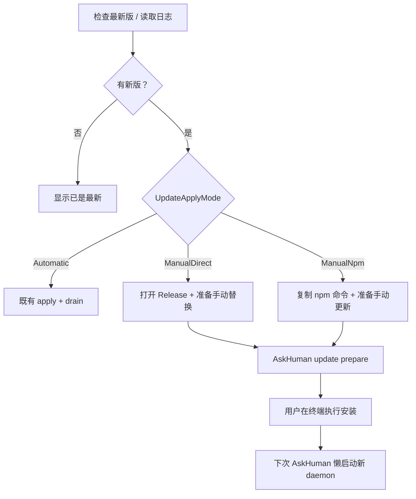

# Windows 未签名发行的更新能力门控计划

状态：**已实施并完成本地 + Windows 11 VM 验证（2026-08-18）**

关联：`docs/specs/self-update.md`、`docs/specs/windows-platform-parity.md`、
`docs/plans/windows-platform-parity.md`、`.github/workflows/release.yml`

## 1. 背景与结论

Windows 功能与 shared daemon 架构已经完成 P7 对齐，但生产 Authenticode 需要身份验证、证书/HSM 或
托管签名服务。当前决定暂缓签名，继续正常发布 Windows zip 与
`@humaninloop/win32-x64` npm 包，名称不增加 `preview` / `unsigned` 标记。

未签名 EXE 可以运行，但当前 Windows Direct/npm 自动更新会下载或安装新 EXE，并把它作为目录外 worker
执行。`SHA256SUMS` 与 EXE 来自同一个 GitHub Release，只能发现传输损坏，不能在 release 账户或流水线
被篡改时提供独立真实性；npm metadata/provenance 也没有被当前运行时验证。因此未签名阶段不能把
WinVerifyTrust 简单删掉，也不能以 checksum 代替 Authenticode 后继续自动执行。

本轮采用以下边界：

1. macOS/Linux 自动更新保持不变；
2. Windows 保留后台/手动检查、版本比较、更新日志、忽略版本和外部换新检测；
3. Windows 应用内不下载、不执行、不替换新 EXE，Direct 与 npm 均改为手动更新；
4. 源码内使用固定 capability 区分，不新增 Cargo feature、用户配置、环境变量或远端开关；
5. 保留现有 Updater、Windows transaction worker、WinVerifyTrust 与签名验证脚本，供安装维护和未来独立
   签名项目复用；
6. 新增 `AskHuman update prepare`，在用户手动安装前安全排空 daemon、关闭 GUI Host 并释放 EXE 文件锁；
7. 继续发布原名 Windows zip/npm，不作 preview 标记；操作入口用中性说明告知自动更新当前不可用。

## 2. 目标与非目标

### 2.1 目标

- 所有 Windows 自动 apply 入口 fail closed，不能从前端、托盘或直接 Tauri IPC 绕过；
- 发现新版与查看日志仍正常，用户有可执行且不打断作答的手动更新路径；
- 手动更新前可靠处理 Windows 运行中 EXE 锁，不要求用户猜测需要结束哪些后台进程；
- 当前未配置 Azure/证书时 release workflow 可正常产出 Windows zip/npm；
- 不删除未来签名后仍有价值的更新事务、回滚和验签实现；
- 对旧 daemon/helper 的增量 IPC 兼容采用 fail-closed 默认值。

### 2.2 非目标

- 本轮不申请 SignPath、Artifact Signing 或商业证书；
- 不设计/实现正式签名 workflow、证书轮换、publisher pinning 或 SmartScreen 认证；
- 不用自建 Ed25519/TUF key 取代 Authenticode；那仍是生产签名系统，且不能改善 Windows Publisher；
- 不新增 Cargo feature、远端 feature flag 或用户可修改开关；
- 不自动运行 `npm i -g`，不自动下载 unsigned EXE，不新增原生 installer；
- 不改变 macOS/Linux 更新行为，不给 Windows 资产或平台文案增加 preview 标签。

## 3. 当前实现审计

### 3.1 已有安全链

- `update::check()` 与 `check_fresh()` 只查版本/日志，可在未签名阶段继续使用；
- `DirectUpdater::apply()` 在 Windows 下载 zip、检查 `SHA256SUMS`、解压、WinVerifyTrust、版本校验后才
  启动下载到临时目录的新 EXE；
- `NpmUpdater::apply()` 在 Windows 从包目录外启动旧 EXE worker，执行 npm 后要求新 target 通过
  WinVerifyTrust 与版本校验，否则恢复旧 EXE；
- Direct worker 还被 `scripts/install-windows.ps1` 复用，用本地已选定 build output 做 hash/version 事务
  安装。它不是纯粹的联网 updater，不能因关闭自动更新而整体禁用；
- daemon 二进制指纹、graceful drain 与 GUI Host shutdown 已存在，可作为手动更新准备的底层能力。

### 3.2 当前缺口

- `release.yml` 无条件 Azure login/sign/verify，缺少生产账户时 Windows release 必然失败；
- 设置、Popup 与托盘只区分“有无更新”，没有“能否自动应用”的 capability；
- `update_apply` 与托盘 handler 直接调用 `select_updater().apply()`，没有统一策略 guard；
- npm 的 `source_url` 实际装的是命令文本，字段语义混合，不足以表达手动 Direct/npm 两种动作；
- Windows 手动运行 npm/替换 EXE 前若 daemon 或 GUI Host 仍在运行，会遇到文件锁；
- `docs/specs/self-update.md` 与 Windows P8 文档仍把 Authenticode 自动更新描述为当前发布门槛。

## 4. 更新策略模型

新增平台策略模块（可放在 `src-tauri/src/update/policy.rs`），由后端作为唯一事实源：

```rust
pub const WINDOWS_AUTOMATIC_APPLY_ENABLED: bool = false;

#[derive(Debug, Clone, Copy, Serialize, Deserialize, PartialEq, Eq)]
#[serde(rename_all = "camelCase")]
pub enum UpdateApplyMode {
    Automatic,
    ManualDirect,
    ManualNpm,
}
```

策略函数按 `target_os + InstallKind` 返回 mode：

- Windows + Direct → `ManualDirect`；
- Windows + npm → `ManualNpm`；
- macOS/Linux → `Automatic`。

`WINDOWS_AUTOMATIC_APPLY_ENABLED` 是源码内固定 capability，不由构建参数或用户状态改变。保留常量而不
直接写散落的 `cfg!(windows)`，使将来的签名项目有单一审计入口；本轮不得把它改为 `true`，也不实现
`true` 分支的正式签名保证。

在 `UpdateInfo` 增加 `apply_mode`，并把当前重载的 `source_url` 拆成明确的展示数据：release URL 始终是
URL，npm 手动命令由后端单独返回或从固定 `NPM_PACKAGE` 生成。持久化 `update.json` 不保存 capability，
避免旧二进制或磁盘状态把策略带进新进程。



## 5. 后端 fail-closed 边界

### 5.1 自动 apply guard

新增统一的 `ensure_automatic_apply_allowed()` / `apply()` 入口，并在 Windows 的两个 updater
`apply()` 分支再次检查策略。至少覆盖：

1. Tauri `update_apply` command；
2. 托盘 `apply_update` handler；
3. `DirectUpdater::apply()` Windows arm；
4. `NpmUpdater::apply()` Windows arm / npm worker staging。

Windows 返回稳定、可本地化的 policy error，不发网络请求、不创建临时目录、不停止 daemon、不写
`pending=true`。前端隐藏/替换按钮只是体验层，安全边界必须在 Rust。

Direct `__update-worker` 不整体禁用，因为 Windows installer 使用它对显式本地 build output 做
hash/version 事务替换；自动下载入口被阻断后，它不再是网络自动更新入口。npm worker 没有安装脚本复用，
可在 worker/staging 两层都拒绝 unsigned 自动路径。所有隐藏 role 仍保留现有 target/worker identity、
hash/version 与 rollback 校验。

### 5.2 IPC 兼容

- `UpdateInfo`、Popup cache payload 与必要的 daemon `UpdateState` 增量携带 `applyMode`；
- 新字段反序列化默认必须是手动/不可自动应用，不能默认 `Automatic`；
- daemon snapshot 每次从当前进程策略派生 mode，不写入 `update.json`；
- 旧 daemon + 新 helper 时可以暂时降级为手动更新；新 daemon + 旧 helper 即使仍显示旧按钮，Rust
  command guard 也必须拒绝。

## 6. `AskHuman update prepare`

新增公开 CLI 子命令，只在 Windows 承担文件锁准备，不下载/安装任何内容。

### 6.1 顺序

1. 读取 daemon status；无 daemon 视为已完成该步；
2. 发送 graceful stop（`force=false`）；有在途请求时进入 draining，并沿用 `daemon stop` 的周期进度；
3. 等待 daemon 真正下线，不提供 `--force`，Ctrl+C 不得杀在途请求；
4. 请求 GUI Host shutdown，并有界等待 named pipe / 进程释放；
5. 输出当前安装类型、安装路径和下一步：
   - npm：`npm i -g askhuman@latest`；
   - Direct：GitHub Releases URL、当前 EXE 路径和替换提示；
6. 仅当 daemon 与 GUI Host 都已停止时退出 0；失败/超时退出非 0，用户不得继续覆盖；
7. 手动安装完成后不自动恢复旧进程；下一次运行 `AskHuman` 会按现有 lazy-start 拉起新 daemon，登录项
   也会在下一次会话恢复 GUI Host。

正常 ask 的 stdout/结果区块不变；`update prepare` 作为显式管理子命令可输出状态，错误与等待进度走
stderr。需要补 CLI help、中英文文案和 Windows-only 清晰错误。

### 6.2 GUI 接线

- **Popup**：仍显示新版与日志；原“一键更新”改为“查看手动更新步骤”。Popup 代表在途回答，不从这里
  主动排空或关窗；
- **设置**：显示“Windows 自动更新当前不可用，请手动更新”。Direct 打开 Releases；npm 显示并可复制
  命令。提供“准备手动更新…”按钮，二次确认后先让用户看到/复制下一步，再启动 prepare helper；
- **托盘**：将 `apply_update` 改为“准备手动更新 vX.Y.Z…”。确认后运行同一 prepare 流程；
- 准备期间显示“等待 N 个请求完成 / 正在关闭后台”，不得把它标为下载或更新成功；
- UI 关闭前必须已把 npm 命令复制或已打开 Direct release 页，避免用户失去下一步；
- 资产名、npm 包名、README 平台名称不增加 preview/unsigned 标签，仅操作位置使用上述中性说明。

GUI 可以通过一个受限 Tauri command 启动当前 EXE 的 `update prepare` helper；helper 与 CLI 共享实现，
避免 GUI 进程请求关闭自身时产生死锁。helper 启动成功后设置/托盘宿主才退出。

## 7. Release workflow 调整

当前未配置正式签名，本轮从 `.github/workflows/release.yml` 移除以下生产步骤：

- `azure/login`；
- `azure/artifact-signing-action`；
- production subject/timestamp verification gate；
- 对 Azure client/tenant/subscription 与 account/profile/subject 的必需配置说明。

Windows build、artifact upload、zip assembly、`SHA256SUMS`、npm platform package 与 GitHub Release 继续
使用原名称和顺序。`scripts/verify-windows-signature.ps1` 与 runtime WinVerifyTrust 保留，CI 继续做 PS5/PS7
解析测试；它们是未来签名项目和负向测试资产，不参与当前 unsigned release gate。

`SHA256SUMS` 文档必须称为完整性校验，不得宣称它证明 publisher 或足以授权自动执行。

## 8. 文档迁移

实现时同步修改：

- `docs/specs/self-update.md`：Windows 状态改为检查/日志 + 手动更新；D19、验收和 Windows worker 说明
  区分 dormant automatic path 与 installer transaction；
- `docs/specs/windows-platform-parity.md`：签名从当前发布完成条件移到明确后置项；功能对齐不回退；
- `docs/plans/windows-platform-parity.md`：P8 记录“用户决定暂缓签名”，引用本计划；
- `docs/PROGRESS.md`：本计划完成后删除实施 section，另保留未来签名/SmartScreen 后置项；
- `docs/overview.md` / 配置与发布说明：更新能力矩阵改成 Windows manual apply；
- README 中不添加 preview 标签；若提到“一键更新”，改为平台准确表述；
- CLI help 与中英文 UI 文案补充 `update prepare` 和中性手动更新说明。

## 9. 测试与验收

### 9.1 Rust / IPC

- 纯函数覆盖三平台 × Direct/npm 的 `UpdateApplyMode`；Windows 两种安装方式都为 manual；
- Windows `update_apply` 在任何网络/文件操作前稳定拒绝；断言无 temp workdir、无 `pending`、daemon 未停；
- Direct/npm updater 的 Windows apply 不能绕过 command guard；
- Direct installer worker 的 hash/version transaction 仍可用于未签名本地安装；
- 新旧 `UpdateState` JSON roundtrip；缺少 `applyMode` 时 fail closed；
- `update prepare` 覆盖 daemon 未运行、GUI Host 未运行、两者运行、在途 drain、shutdown 超时与非 Windows；
- npm/direct 指令和路径只由固定常量/系统路径生成，不拼接用户输入到 shell。

### 9.2 前端 / 托盘

- platform mock：macOS/Linux 保留 Update；Windows Popup/设置/托盘不出现自动 apply；
- Direct 显示 release 动作，npm 显示正确命令与复制反馈；
- prepare 二次确认、等待态、失败态、窗口退出顺序；
- 即使构造旧 UI 调用 `updateApply()`，后端错误仍以手动提示呈现，不显示“更新完成”；
- 更新日志、忽略版本、后台 badge 与当前版本日志无回归。

### 9.3 Windows VM

1. PS5/PS7 installer、zip/npm 两种安装仍通过；
2. unsigned build 检查新版能显示日志，但所有自动 apply 入口不下载、不执行；
3. 打开 Popup + 设置 + GUI Host 后运行 `AskHuman update prepare`：命令等待回答，回答后 daemon/Host
   下线并返回 0，无强制取消；
4. 终端手动执行 npm 更新或 Direct 替换，确认文件锁已释放；
5. 下一次 `AskHuman` 懒启动新 daemon，配置、历史、IM 与登录项不丢失；
6. 模拟 prepare 中断/Host shutdown 失败，确认返回非 0 且不会误报已更新；
7. 最终复跑 Vitest、Node tests、Rust full suite、strict Clippy、release build 与 PS5/PS7 安装矩阵。

### 9.4 macOS/Linux 回归

- 自动更新按钮、apply、下载进度、签名/TeamID（macOS）、原子替换与 drain 行为保持原样；
- Windows policy 字段的 fail-closed 兼容不能让 Unix 旧 daemon 长期错误降级；daemon 换新后恢复
  `Automatic`。

## 10. 实施顺序与提交边界

1. `refactor(update)`：加入 `UpdateApplyMode`、源码常量与集中 policy，扩展 IPC/TS 类型；
2. `fix(update,windows)`：在 command、tray、Direct/npm apply 处 fail closed，保留 installer worker；
3. `feat(update,windows)`：实现 `AskHuman update prepare` 与 GUI helper 生命周期；
4. `fix(ui,windows)`：Popup/设置/托盘改为手动动作和中性说明；
5. `ci(release)`：去掉当前不可用的 Azure production signing gate，继续产出同名 Windows 包；
6. `test(update,windows)`：自动化、PS5/PS7 与 VM 手动更新矩阵；
7. `docs(update,windows)`：迁移 self-update/Windows spec、overview、help 与 `PROGRESS.md`。

每一步都必须保持工作区可编译；功能逻辑变化后运行 `./scripts/install.sh`，再用新安装的 AskHuman 继续
AskHuman 验收。Windows VM 上必须先证明自动 apply 在网络前被拒绝，再测试 prepare 与手动更新，避免用
一次成功的手动安装掩盖旧自动入口仍可达。

## 11. 退出条件

- Windows 所有 UI/IPC/trait 自动 apply 入口 fail closed，Direct/npm 均无绕过；
- 检查、日志、忽略、提示与 macOS/Linux 自动更新无回归；
- `AskHuman update prepare` 在真实在途请求下不打断作答，并在返回 0 时释放 daemon/GUI Host 文件锁；
- 原名 Windows zip/npm 可由 release workflow 在没有 Azure/签名配置时发布；
- 文档不再宣称当前 Windows 支持 Authenticode 自动更新，也不把平台标成 preview；
- updater transaction、rollback、WinVerifyTrust 与 verifier 代码仍保留；
- 未来签名重新启动前，`WINDOWS_AUTOMATIC_APPLY_ENABLED` 保持 false。届时需另立项目完成 provider、
  publisher identity pinning、timestamp/轮换、签名产物等价性、SmartScreen 与 signed update/rollback，
  不能只把常量改成 true。

## 12. 实施与验证记录（2026-08-18）

### 12.1 实施结果

- `src-tauri/src/update/mod.rs` 固化 `WINDOWS_AUTOMATIC_APPLY_ENABLED = false`，并为 Direct/npm 派生
  `manualDirect` / `manualNpm`；缺少 `applyMode` 的旧 IPC payload 默认 `manualDirect`，不会误开自动路径。
- Tauri `update_apply`、托盘 `apply_update`、`DirectUpdater::apply()` 与 `NpmUpdater::apply()` 均在副作用前
  执行同一策略 guard；Windows 专属测试直接调用两个 updater trait 入口，均在 download/npm staging 前拒绝。
- `UpdateInfo` 分离 release URL 与固定 npm 命令；Popup 只跳转手动步骤，设置负责二次确认和保存下一步，
  托盘进入同一设置锚点。macOS/Linux 继续返回 `automatic`，原有 apply 路径不变。
- 新增公开 `AskHuman update prepare`。它请求 daemon graceful stop、持续等待在途请求清零、关闭 GUI Host，
  再输出 Direct/npm 下一步；不提供 `--force`，也不下载或安装内容。
- Windows 实测发现 Settings Host 的 30 秒更新检查会让普通 Tauri exit 暂时持有 EXE 锁。Host shutdown 现先
  回 ACK，再执行 Tauri cleanup 和 Host-only 进程退出；helper 重试到 named pipe 消失并有 45 秒上界。
- release workflow 删除 Azure OIDC login/sign/subject gate，继续沿用原 Windows zip/npm 名称。事务 worker、
  rollback、WinVerifyTrust 和 `scripts/verify-windows-signature.ps1` 均保留。

### 12.2 本地回归（macOS）

- `pnpm build`：通过；
- `pnpm test`：26 个 Vitest 文件 / 165 项测试通过，5 项 Node 测试通过；
- `cargo test --manifest-path src-tauri/Cargo.toml`：1138 通过、0 失败、2 忽略；
- `cargo clippy --all-targets -- -D warnings`：通过；
- `cargo build --release --features custom-protocol`：通过；
- `./scripts/install.sh`：完成前端嵌入、`local-install` build、本机安装与 macOS 签名；
- `cargo fmt -- --check`、`git diff --check`：通过。

### 12.3 Windows 11 VM 回归

- `pnpm build`、26 个 Vitest 文件 / 165 项测试、5 项 Node 测试：全部通过；
- Windows update 专属测试：19/19 通过，含固定策略 guard、缺字段 fail closed、Direct download 前拒绝、
  npm staging 前拒绝；
- Rust 全量：1127 通过、0 失败、2 忽略；严格 Clippy：通过；
- 全量首次运行有一个既有并发令牌测试抖动（两个消费者同时获胜）；该用例单独复跑和随后两次全量中的
  最终一次均通过，且与 update/GUI Host 变更无共享代码；记录为测试噪声，没有隐藏为通过结果；
- `scripts/install-windows.cmd` 完成前端构建、`local-install` Rust build、事务替换、PATH 与 launcher 校验；
  安装后的 EXE 执行 `update prepare` 返回 0，并输出 release、target 和替换步骤；
- 空闲 daemon + Settings Host 场景返回 `ready`，随后对 EXE 的 `FileShare.None` 独占读写打开成功；
- 交互桌面计划任务制造 1 个真实在途请求：helper 明确报告并等待 `1 active request`，测试调用方结束后
  daemon drain、GUI Host 下线，helper 返回 0 并输出 `interactive-drain-test-ok`；
- 所有临时计划任务、driver、日志、传输包和隔离目录均按精确名称删除，并以
  `windows-vm-cleanup-ok` 验证无残留。

### 12.4 外部 Review correctness 复核

Windows 平台逻辑二次 Review 后又收口了四项真实问题：GUI Host 不再把 named pipe 当文件监听，改为
监听真实的 `daemon.json` 生命周期文件；Popup 只有在 Windows 上才把带 `launchId` 的 Agent 标成
Windows Terminal；workspace、launch claim 和 permission rule 复用同一个 Windows
case/separator-insensitive 路径身份原语；`which_codex` 不再把 macOS Homebrew 路径列为 Windows 候选。
旧 workspace 若已按路径大小写重复保存，会合并 pinned、hidden、agent 和最近使用元数据而不丢失。

Review 同时声称 `std::fs::rename(temp, existing)` 在 Windows 不能覆盖目标。该前提对当前工具链不成立：
Rust 1.94.1 的 Windows 标准库 backend 使用带 `MOVEFILE_REPLACE_EXISTING` 的 `MoveFileExW`，Win11 VM
Rust 1.97 上 `private_atomic_write_overwrites_without_leaving_temporary_files` 和 update state 重复写测试也都
在已有目标文件时通过。因此没有引入全仓 atomic-file 重构，反而删除 login launcher、terminal focus 和
private state 写入中会先删除目标、制造不可用窗口的旧 fallback。最终 macOS/Windows 全量测试、strict
Clippy、前端构建/测试和两端标准安装脚本均重新通过。

实际 GitHub release job、干净 Windows 10 22H2、完整 DPI/多屏/输入法/渠道桌面矩阵仍属于
`docs/PROGRESS.md` 的外部发布验收，不影响本轮 unsigned capability gate 与 shared daemon 架构完成。
