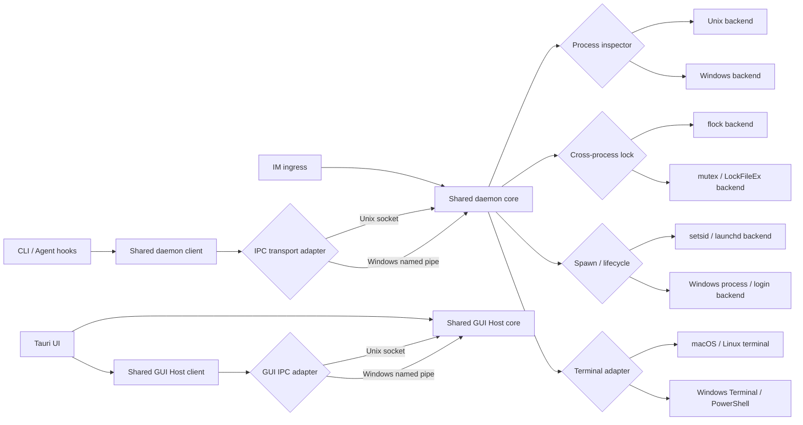

# Windows 平台功能与架构对齐规格

状态：**功能与 shared daemon 架构实现完成；等待 Windows 10 与桌面/渠道外部验收**

基线版本：`b216b333`（AskHuman 0.12.2）

形成日期：2026-08-15

## 1. 背景与问题定义

> 本节与 §3 记录 2026-08-15 开工前基线，用于解释本项目为何需要架构对齐；当前实现状态与实测证据见
> `docs/plans/windows-platform-parity.md` 的「实施记录」。

AskHuman 的 daemon、GUI Host、Agent 生命周期、主动 IM 命令、自更新等能力在演进过程中曾主要落在
Unix 实现上。Windows 曾保留早期的“单次 CLI 进程直接完成部分操作”的降级路径，因此当时差距不是
少量 `cfg(windows)` 分支，而是平台架构已经分叉：

- Unix：CLI / hooks / GUI 通过本机 IPC 连接常驻 daemon，daemon 统一持有 IM 长连接、Agent 状态和
  共享数据；GUI Host 负责窗口、托盘与桌面交互。
- Windows：daemon 与 GUI Host 均未实现；大部分依赖它们的入口被隐藏或直接报告
  `windows_daemon_unsupported`，部分文件锁与进程识别退化为空实现。

本轮目标是消除这条产品级分叉，让 Windows 与 macOS/Linux 共用同一业务核心和协议语义，只在
IPC、进程、锁、启动项、终端和桌面能力等操作系统边界保留适配器。

“对齐”指相同用户场景具备相同结果、错误语义、并发约束和恢复能力；不要求复制 macOS 特有的
视觉材质、Quick Look、系统语音等平台专属表现。

## 2. 已确认范围

| 项目 | 决策 |
|---|---|
| 正式支持系统 | Windows 10 22H2 x64、Windows 11 x64 |
| 旧版 Windows 10 | 1709–21H2 best-effort，不作为发布 gate |
| 不支持 | Windows 7/8/8.1 |
| 架构 | 与 Unix 共用一个 daemon 业务核心，平台适配器承接系统差异 |
| 会话模型 | 单个交互式桌面会话；SSH 只用于构建和自动测试 |
| Agent 实机范围 | 首轮以 Codex 为必达 E2E；Claude/Cursor/Grok 做配置、协议和模拟测试 |
| 分发 | zip 与 npm 为本轮必达；原生安装器后置 |
| 签名 | 生产 Authenticode/SmartScreen 暂缓为独立后置项目；当前原名 zip/npm 未签名发布，自动更新固定关闭 |
| 集成方式 | 长期开发分支完成全套能力和 gate 后一次合并主线；分支内保持小提交和阶段 gate |
| 后置范围 | Windows ARM64、Windows Server/RDS 多会话 broker、原生安装器 |

发布前还需补一台真实 Windows 10 22H2 x64 VM。当前 Windows 11 VM 是主开发与持续实测环境。

## 3. 实施前现状证据（历史基线）

### 3.1 代码结构

基线代码 `b216b333` 的主要平台断点如下；这些条目已由本项目实现消除：

| 能力 | 当前实现与断点 |
|---|---|
| daemon | `daemon/mod.rs` 只有 `unix_impl`；非 Unix 入口直接返回不支持 |
| daemon IPC | `ipc/transport.rs` 只有 Unix domain socket；`client/mod.rs` 直接绑定 Tokio Unix stream halves |
| GUI Host | 单例锁、IPC server 和 client 均基于 Unix socket / `flock` |
| daemon 生命周期 | 锁、后台拉起、脱离终端、launchd 协调均为 Unix 实现 |
| CLI 能力面 | `ask_question`、daemon client、Agent lifecycle/stop/permission 等入口受 `cfg(unix)` 限制 |
| Agent 识别 | 进程链依赖 `ps`、`kill(pid, 0)`、`getppid`；Windows 后端为空或恒 false |
| Agent hooks | 多处 capability 以 `cfg!(unix)` 判定；Claude/Cursor 旧 timeout hook 使用 `.sh` |
| 并发写入 | todo、history、update、integration 等跨进程锁在 Windows 退化为空实现 |
| 托盘与窗口 | Tauri tray 模块被 `cfg(unix)` 整体排除；GUI Host 单例窗口入口不可用 |
| 系统交互 | Windows 系统提示音、用户 hook 扩展、Windows Terminal 启动/分叉未实现 |
| 自更新 | direct update 在非 Unix 返回不支持；npm 命令执行未处理 Windows `.cmd` 规则 |
| CI | Windows 只构建前端和 release binary，不运行 Rust tests、Vitest 或 clippy |

### 3.2 Windows 11 VM 基线

在干净的 Windows 11 Home 24H2 x64 VM、仓库同一 commit 上得到以下结果：

1. `scripts/install-windows.ps1` 在 Node 24.19 下失败。前端构建辅助脚本直接
   `spawnSync("pnpm.cmd", ...)`，Node 24 在 Windows 返回 `EINVAL`；这也是当前安装链第一处阻断。
2. `cargo test` 共运行 970 个测试：941 通过、27 失败、2 忽略。失败集中在 Unix 路径假设、Agent
   支持矩阵、进程归属、权限规则/记忆与跨平台路径语义，不是单一模块偶发失败。
3. debug binary 可以构建并执行静态 CLI：
   - `daemon status` 报告平台不支持；
   - `agents monitor --text` 因 daemon 不可用而失败；
   - `doctor --json` 显示 daemon、channel、Agent lifecycle/permission、terminal/login item
     等关键能力均不可用。
4. VM 当前没有安装 Claude/Codex/Cursor/Grok；真实 Codex E2E 留在 Agent 阶段执行。
5. VM 同时具备 Windows PowerShell 5.1 与 PowerShell 7.6.5。安装和维护脚本需要明确兼容两者，不能
   假设 `pwsh` 已存在。

VM 上的构建产物和安装尝试没有改动仓库源文件；VM 仓库保持 clean。

## 4. 产品能力要求

以下编号用于实施计划、测试和验收追踪。

### WP-01：统一 daemon 数据面

- Windows CLI、hooks、GUI 与 IM 入口必须通过与 Unix 相同的 daemon 协议完成请求。
- daemon 必须是唯一 IM Router，持有四个渠道的长连接、请求去重/合并、配置热加载、Agent registry、
  graceful drain 与更新状态。
- 最终发布不得保留 Windows 产品级“绕过 daemon 的单进程实现”。可保留只用于诊断、默认关闭且
  不承诺兼容的内部 opt-out。
- 同一错误在三个桌面平台使用相同 error code 和可理解的人类提示。

### WP-02：安全的本地 IPC

- daemon 与 GUI Host 分别使用 Windows named pipe；wire protocol 继续使用当前 NDJSON framing，
  不复制业务协议。
- pipe 名称必须按用户/登录身份与 AskHuman `config_dir()` 分区，使正式实例和 Dev Instance 不串线。
- pipe ACL 只允许当前用户和必要的系统身份，拒绝远程客户端；不能只依靠难猜的 pipe 名称。
- Windows server 接受连接时，应在移交已连接实例之前预先创建下一 pipe instance，避免并发连接窗口。
- client 遇到 `ERROR_PIPE_BUSY` 时按有界退避重试，且保留 daemon 自动拉起和版本握手语义。
- transport 对业务层暴露跨平台 reader/writer 抽象，daemon 核心不得引用 Unix stream concrete type。

### WP-03：单例、锁与进程角色

- daemon 和 GUI Host 在同一 AskHuman 实例中各自只能有一个 owner。
- Windows 后端使用具备清晰 ownership/abandon 语义的 named mutex、独占 pipe instance 或
  `LockFileEx`；不能延续 no-op lock。
- todo、history、update、integration 配置等所有跨进程 read-modify-write 路径必须使用共享的
  跨平台锁抽象。
- 保持单二进制、多角色模式。后台 daemon/helper/GUI Host 在 Windows 上不得弹出额外 console；
  正常 CLI 仍继承当前终端 stdout/stderr。
- 崩溃、强杀、电脑睡眠/恢复、用户注销后，锁和 pipe 必须可恢复，不留下永久“已运行”假象。

### WP-04：daemon 生命周期与登录启动

- 首个需要 daemon 的客户端可以按现有语义懒启动它，并等待 readiness/version handshake。
- Windows 使用当前用户范围的登录启动，不请求 UAC；启用、禁用、升级和卸载必须幂等并可清理。
- 版本变化、二进制被替换、配置变化和 graceful drain 与 Unix 具有同样的状态机结果。
- 本轮只承诺一个交互式桌面会话。RDS/同一用户多个交互会话要单独设计 router/broker，不能悄悄共享
  错误桌面的 GUI Host。

### WP-05：GUI Host、托盘与桌面窗口

- Windows GUI Host 必须提供 question popup、history、settings、todos、Agents console、new task、
  fork、interject 等已有桌面入口。
- 托盘菜单、启停 IM、状态展示、打开各窗口与退出行为应与现有产品语义一致。
- popup 预热、前台聚焦仲裁、pin/find/composer 等已实现功能必须经 WebView2 实机矩阵验证。
- 视觉效果使用 Windows/WebView2 可稳定支持的等价呈现；macOS blur、Quick Look、语音输入等平台
  专属能力不构成对齐门槛。
- Windows 系统提示音与用户自定义 hook 要支持原生路径/命令格式，并保持当前超时和失败隔离。

### WP-06：Agent 进程与工作区识别

- 抽象进程检查器，提供 PID 存活、父子链、可执行文件、命令行、会话和工作区归属等核心能力。
- Windows 后端优先使用系统 API/Rust library（如 Toolhelp / process query），不能在高频 hook 热路径
  反复启动 PowerShell。
- Windows path 比较必须处理 drive letter、反斜杠、大小写、UNC、符号链接/规范化失败等情况，并在
  身份证据不足时 fail closed。
- Agent registry、pending request partition、claim/context binding、终止检测和 watchdog 的结果语义
  必须与 Unix 一致。

### WP-07：Codex Windows 集成必达

- 首轮真实 E2E 使用 Codex Windows CLI，覆盖 AskHuman 提问、SessionStart/SessionEnd、生命周期、
  compaction 恢复、interject、permission remember、stop confirmation 与 task/workspace 归属。
- hook 生成器应按当前 Codex schema 写 Windows 命令（包括需要时的 `commandWindows` / 等价配置），
  并重新验证 trust、身份签名和 managed/user/project 配置层叠。
- 路径中有空格、非 ASCII、不同 shell、无交互桌面的 hook 调用都要有自动或实机覆盖。
- Claude/Cursor/Grok 在本轮至少通过 schema/config round-trip、模拟进程树和协议测试；未做真实 E2E 的
  Agent 必须在文档/doctor 中如实标记验证等级，不能假装等同于 Codex。

### WP-08：主动 IM 与 Windows Terminal

- Windows daemon 必须支持现有主动命令和状态流，包括 `/new`、`/fork`、`/status`、`/watch`、
  `/msg`、`/yolo`、`/diff`、`/stage`、`/transcript`、`/todo` 及相应桌面入口。
- 新建/分叉任务通过 Windows Terminal/PowerShell adapter 启动，传参采用精确 argv/Windows quoting，
  不拼接用户输入到 shell command string。
- 没有 Windows Terminal 时要有清楚的可恢复错误或受支持 fallback。
- 启动后必须等 Agent lifecycle ready，再把任务视为成功，避免“开了窗口但未注册”的假成功。

### WP-09：zip/npm 分发与自更新

- zip 中的独立 `.exe` 和 npm platform package 都必须完成首次安装、升级、回滚与清理验证。
- Node/包管理器的 `.cmd` 调用必须遵循 Windows process creation 规则，兼容 Node 24，不通过不受控的
  shell 字符串插值。
- Windows 正在运行的 `.exe` 不能原地覆盖：direct updater 使用临时目录中的 updater worker，协调
  daemon/GUI Host/helper drain，替换目标，保留可恢复备份，并按原状态重启。
- npm 全局升级也必须先释放 package 内的 `.exe`，再由外部/临时 worker 执行升级；失败时不能留下
  半安装状态。
- PowerShell 5.1 与 7 均需支持安装脚本；编码、执行策略提示和路径含空格必须有测试。installer
  幂等加入当前用户 `PATH`，并在标准 per-user `WindowsApps` 目录维护命令 launcher，使 Agent 跨 session
  安装后既有终端立即可用；uninstaller 只删除自身管理的 launcher 和安装目录，不覆盖其他条目。

### WP-10：Windows CI 与可观测性

- Windows CI 至少运行前端测试/构建、Rust tests、release build，以及适用的 lint/clippy；Windows
  warning 不得长期作为非阻断噪声。
- OS adapter 需有 unit/integration tests；named pipe、锁、daemon restart/update 等需 Windows 原生测试。
- `doctor --json` 输出必须区分“未配置”“当前不可用”“平台不支持”“未做真实 Agent E2E”，支持远程
  SSH 排障但不误判 GUI 可用性。
- 日志不能泄漏 pipe ACL token、hook payload、渠道 secret 或用户输入。

### WP-11：兼容性与发布门槛

- 正式矩阵：Windows 11 x64 主 VM + Windows 10 22H2 x64 发布 VM + GitHub Windows runner。
- Windows 10 1709–21H2 仅 best-effort；不能因为它们失败而阻止发布，但不能引入已知可避免的
  系统版本依赖。
- 当前未签名发行必须在代码层关闭所有自动 apply，只保留检查、日志和 `AskHuman update prepare` 手动
  闭环；生产 Authenticode、publisher pinning、timestamp 与 SmartScreen 另立项目后再恢复自动更新 gate。
- ARM64、native installer 与 RDS 多会话不得在本轮“顺手”加入，避免扩大未验证面。

## 5. 目标架构

### 5.1 模块边界

实施结果已把历史 `daemon/unix_impl` 拆为：

- `daemon/server` 或 `daemon/runtime`：请求路由、Agent registry、IM channels、watch/config、drain、
  update coordination 等平台无关业务核心；
- `ipc/transport/{unix,windows}`：listener、connect、split、peer identity 和 endpoint naming；
- `platform/process/{unix,windows}`：进程/会话/命令行检查；
- `platform/lock/{unix,windows}`：单例与文件级跨进程锁；
- `platform/spawn/{unix,windows}`：daemon/helper/GUI Host 后台启动和 login item；
- `platform/terminal/{macos,linux,windows}`：任务窗口启动；
- `platform/sound`、`platform/user_hook`：小型系统能力。

业务模块只能依赖 trait/enum wrapper 和统一 error，不允许重新用大块 `cfg(unix)` 包住核心功能。
`cfg` 应尽量收敛在 platform adapter 和极少数平台专属 UI 上。

### 5.2 演进与切换

开发分支内可临时保留旧 Windows fallback 作为对照，但新旧路径不得长期双写真实用户数据。每个阶段用
内部 feature/diagnostic switch 验证新链路；最终 cutover 一次完成：

1. Windows 所有公开入口切到 shared client/daemon；
2. 删除产品级 fallback 和 `windows_daemon_unsupported` capability 分支；
3. doctor 与 UI capability 由运行时探测决定，而不是 `cfg!(unix)`；
4. 通过完整 VM gate 后合并主线。

## 6. 验收定义

### 6.1 自动验收

- Windows CI 的 build、Vitest、Rust tests 和适用 lint 全绿，无未分类 Windows warning。
- shared core 在 Linux/macOS/Windows 使用同一组协议与状态机 tests。
- Windows 原生测试覆盖 named pipe 并发连接、ACL/peer、daemon race/restart、abandoned lock、路径、
  hook quoting、进程树、update/rollback。
- Unix 现有功能和测试无回归。

### 6.2 VM 功能验收

Windows 11 和 Windows 10 22H2 两台 VM 都应验证：

- zip/npm 的干净安装、登录后启动、升级、回滚、卸载/清理；
- tray、popup、history/settings/todos/Agents console、新建、分叉、interject；
- 四渠道配置与模拟/测试服务下的单连接、收发、去重、断线恢复和主动命令；
- Codex 真实生命周期和交互全链路，包括重启、compaction、权限、stop；
- 睡眠恢复、daemon/GUI Host 强杀、重复并发启动、路径含空格与中文、非管理员用户；
- WebView2 的主题、缩放、多显示器/DPI、键盘、find/pin/composer 和错误页；
- 未签名 binary 的所有自动 apply 入口在网络/文件操作前 fail closed；Direct/npm 手动更新前能排空
  daemon/GUI Host 并释放 EXE 锁。

只通过 SSH 构建或只看到 `cargo test` 绿色，均不算完成桌面验收。

### 6.3 发布完成条件

以下条件必须全部满足，才可把 Windows 标为与 macOS/Linux 功能对齐：

1. WP-01 至 WP-11 有实现 commit、自动测试与验收证据；
2. 两台 VM 的人工矩阵有日期、版本、结果和已知限制；
3. `docs/overview.md`、相关 specs、安装/发布文档与真实行为一致；
4. `docs/PROGRESS.md` 的本项被删除或只留下明确后置项；
5. 签名配置最后完成并通过 release artifact 验证；
6. 长期开发分支最终 diff 经审查后一次合并主线。

## 7. 非目标

- Windows ARM64 构建、Agent 与真机矩阵；
- `.msi`/MSIX/NSIS 原生安装器、开始菜单和系统卸载项；
- Windows Server、RDS、同一用户多桌面会话 router/broker；
- Windows 7/8/8.1；
- 将 macOS 专属材质、Quick Look、系统语音逐像素复制到 Windows；
- 首轮为 Claude/Cursor/Grok 各准备完整 Windows 实机 E2E（但不能省略模拟与配置兼容测试）。

## 8. 主要风险与约束

- **核心抽取风险（已收口）**：历史 `daemon/unix_impl` 体积大且混合 transport concrete types；本轮先以
  协议/状态机测试固化行为，再机械迁入 `daemon/runtime`，没有为 Windows 复制第二套 daemon。
- **安全风险**：named pipe 默认 ACL、远程访问和跨登录会话行为容易被误用；ACL 与 peer/session
  验证是功能的一部分，不是发布前补丁。
- **进程身份风险**：Windows 进程树、命令行访问权限和 path canonicalization 与 Unix 不同；证据不完整
  时要 fail closed，不能放松 permission/stop 的安全边界。
- **更新风险**：运行中的 Windows executable 被锁定。更新必须从目标文件之外执行，并具备明确 rollback。
- **长期分支风险**：一次合并不等于一个巨型提交。每阶段保持可审查提交、定期吸收主线，并设置内部
  gate，降低最终集成风险。
- **签名风险**：证书采购、secret、timestamp 服务和 CI 权限可能拖延；按决策放在最后配置，但应在早期
  定义 artifact/sign/verify 接口，避免最终重做打包结构。

## 9. 参考资料

- [Node.js child process：Windows `.bat`/`.cmd` 需要 shell、exec 或 `cmd.exe`](https://nodejs.org/docs/latest-v24.x/api/child_process.html#spawning-bat-and-cmd-files-on-windows)
- [Tokio Windows named pipe API](https://docs.rs/tokio/latest/tokio/net/windows/named_pipe/index.html)
- [Microsoft：Named Pipe Security and Access Rights](https://learn.microsoft.com/windows/win32/ipc/named-pipe-security-and-access-rights)
- [Rust Platform Support](https://doc.rust-lang.org/rustc/platform-support.html)
- [Microsoft Edge WebView2 supported operating systems](https://learn.microsoft.com/microsoft-edge/webview2/concepts/supported-platforms)
- [Codex Hooks 文档](https://learn.chatgpt.com/docs/hooks)
- [Claude Code Hooks 文档](https://docs.anthropic.com/en/docs/claude-code/hooks)
